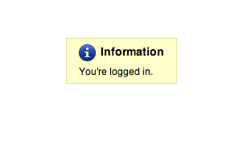

## Logging in to Cascade {#logging-in-to-cascade}

Open a browser and enter the following URL (or click this link): [http://mordac.itcs.northwestern.edu/](http://mordac.itcs.northwestern.edu/)You will be redirected to the NU Online Passport Single Sign-On page.

Enter your Net ID and password. Then press “Enter” or click “Log In.” Click “Continue” if a security warning message pops up.

This security warning is not an indicator of an actual security threat; it can safely be ignored while using Cascade.

****

**NOTE:** On occasion after logging into Cascade, your browser may indicate you are logged in, but not take you to Cascade’s Home Screen.

Should this error occur, simply return to the login URL ([http://mordac.itcs.northwestern.edu/](http://mordac.itcs.northwestern.edu/)) and your browser will automatically redirect you to the Home Screen, so you can begin working in Cascade.

Best Practice:

**McCormick IT recommends Cascade users work in Chrome or Firefox.** Internet Explorer also works, but Chrome and Firefox generally perform better.

**Mac users** are also advised to use Chrome or Firefox.

When previewing changes to your website in a browser, it is suggested to avoid using Firefox since you may need to force its cache to refresh in order to load your site’s latest content changes.