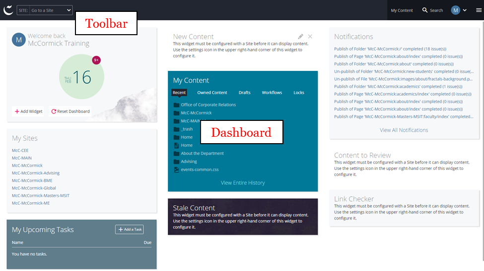

## The Home Screen {#the-home-screen}

The first thing you’ll see upon logging in to Cascade is the Home Screen, which serves as a sort of home base for your work while logged into Cascade.

The Home Screen consists of two main areas:

*   The **toolbar**, which runs across the top of the screen, allows you to perform some actions, such as returning to the home screen and navigating to a specific website.
*   The **dashboard / main panel_,_ **which takes up the majority of the screen, changes according to the task you are performing. It offers a view of helpful site widgets that users can add, remove or move.