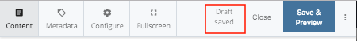
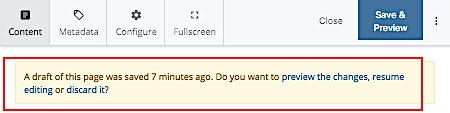
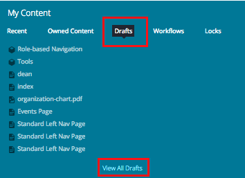

## Draft {#draft}

A “Draft” is exactly what the name implies: a working, but not complete, copy of a webpage with changes in progress. Drafts are automatically created and periodically updated as you work on a page.

To save a page as a draft, click the “**Save & Preview**” button at the top right of the Edit window. This allows you to view your draft after saving it.

Drafts are useful when you’re working on a page but need to stop and focus on something else for a while. If you go back in **Edit** mode, you’ll see a yellow bar with three options:

1. **Preview the changes** – If you click here, you see a preview of your draft. You can also see a preview of the last saved version from here.
2. **Resume editing –** allows you to edit your draft.
3. **Discard it** – if you click here, your draft will be discarded

You can find all saved drafts under the **My Content** widget on your Dashboard.

#### Important:

**You are the only person who can see your draft of a page.**

If you’ve made changes to a page but saved it as a draft \(instead of clicking “Submit”\), **other users will not be able to see your changes when they open the page.**

If you need another user to see your changes, go ahead and click “Submit” — it’s easy to roll back changes in Cascade, if needed.

