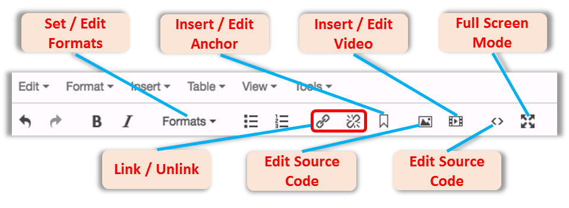
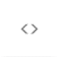
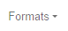

## Editor Toolbar - WYSIWYG {#editor-toolbar-wysiwyg}

Since Cascade uses a WYSIWYG (What You See Is What You Get) editor, the formatting you apply to your content is generally how it will appear on your website.

Cascade’s editor toolbar lets you apply the same basic formatting you’d have access to in any word processor — headers, paragraph (body) copy, bulleted and numbered lists, bold, italics, and much more.

Many of the options on the Cascade editor toolbar (especially the ones on the left side) will be familiar to users of common word processing software. You can perform many of the same actions to format text as you can in a program like Microsoft Word.

Important!

Use only Cascade’s built-in formatting tools!

McCormick IT has configured Cascade’s text formatting to ensure that web pages are **uniform** and **consistent** throughout McCormick websites.

As such, editors should refrain from making adjustments to the HTML code that would do things like changing the font size, color, or typeface.

There are six drop-down menus in the toolbar as follows:

*   **Edit** menu allows you to edit content through undo, redo, cut, copy, paste, paste as text, and select all functions.
*   **Format** menu enables you to set the format of content to bold, italic underline, strikethrough, superscript, subscript, and to clear the formatting. You can also access the Formats menu.
*   **Insert** menu contains functions to include links, anchors, images, media, special characters, horizontal lines, and data/time.
*   **Table** menu allows you to insert and edit tables. It is advised to **not use tables on the site.** If you have information that absolutely needs a tabular display, please contact marketing at web-updates@mccormick.northwestern.edu.
*   **View / Tools** menus provide functionality to help users in terms of view, spellcheck, and source code.

Also, there are some shortcut tools – noted in the graphic above – that may require some additional explanation with regards to how they function.

**Link/Unlink:** These tools will allow you to create/edit hyperlinks out of any text or image within your body content.

**Insert/Edit Anchor:** Anchors allow you to mark points anywhere on your web page so that they can be easily accessible by users. They are most often used on web pages with a large amount of content, as they offer the ability to go directly to a single piece of content rather than scrolling down through the entire page.

**Insert/Edit Image:** Select this icon to insert an image into your page. Please read the “Inserting Images” section of this manual for important information on this process [page **00**].

**Insert/Edit Video:** Select this icon to insert a video into your page. Please read the “Inserting Videos” section of this manual for important information on this process [page **00**].

**Edit HTML Source:** This option allows you to take a look “under the hood” at the actual code that you’re creating through the Cascade editor. However, it is advisable to leave this alone unless you are familiar with HTML code – changes made here can affect the functionality of your site.

**Full screen Mode:** Clicking this icon will move your view to a full screen mode in your browser to allow for added working space. Click the icon again to return to the standard view.

**Set / Edit Formats:** Clicking this drop-down menu will provide a shortcut to set or edit headings, inline, blocks, alignment, and custom classes.

**NOTE:** You will notice buttons in the editor toolbar to “underline,” and “indent” text in the editor window. Those styles are **not** preserved when you submit your page in Cascade and will not publish.