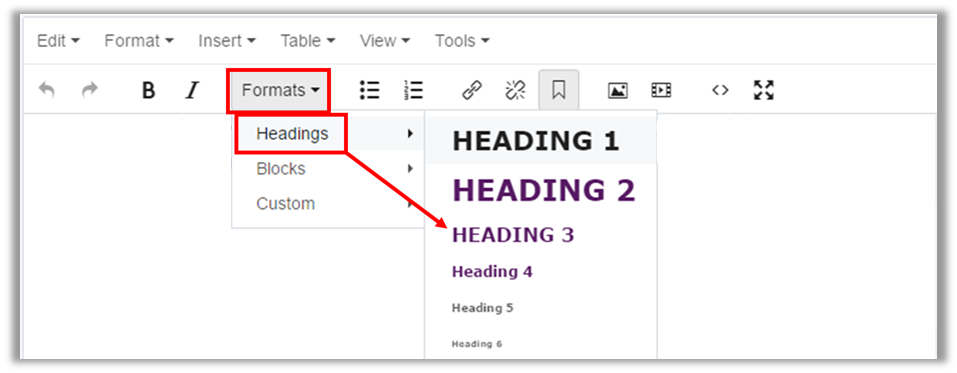

## Headings and Subheadings {#headings-and-subheadings}

It is important to keep your content well organized so your visitors can easily navigate and find the information they need. Use headings and subheadings on your pages to create a visual hierarchy for your visitors, similar to a document outline.

To create a heading in Cascade, select the text you wish to use as a header, then, in the Cascade Editor window, click the “Formats” drop-down menu and then “Headings” menu. Finally, select “Heading 2” or “Heading 3.”

The importance of a heading descends as its number ascends, so information used as a Heading 2 should be more important than that of a Heading 3\.

Best Practice:

Use Headings and Subheadings Frequently!

• Use “**Heading 2**” to make a **header** in your page’s main content area.

• Use “**Heading 3**” to make a **subheader** in page’s main content area.

For additional information on using headings and other formatting to improve your website’s searchability, **read the section of this guide titled “Optimizing Your Content”.**

**NOTE:** With this website template, you should not use any “Heading 1” or “Heading 2” formatting, since Cascade automatically formats your site and page titles to those headings.