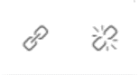
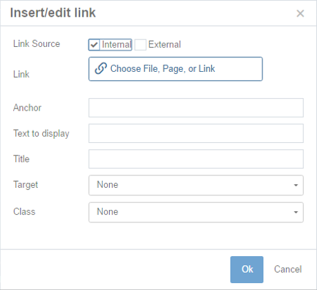
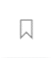

## Inserting and Editing Links {#inserting-and-editing-links}

To create a hyperlink on a line of text or an image, highlight that piece of text or the image you’d like to link and click the chain-link button in the Cascade editor toolbar.

From there, you will need to specify the following:

*   whether the link target is an internal page or an external URL
*   whether the link will open in the same window or in a new window
*   what the link’s title (which appears as the floating “tool tip” when a user hovers over link text) will be

**NOTE**: **External links** that go to webpages that are not part of your own site should open in **a new window**. **Internal links** to pages on your site should stay in the **same window**.

**To create a link to someone’s email address**, select the external link option and type “mailto:” followed by the desired email address in the URL field. For example, if you wanted to link to John Smith’s email address, type “mailto:john.smith@northwestern.edu” (without quotes) in the external URL field. In the “Title” field, enter something like “E-mail John Smith.” When a visitor clicks on that link on your website, their default email program will open a new email to that email address.

You can also use this tool to point to a page anchor, which is discussed in more detail below.

To edit a link, select the link in your editor window and click the chain-link button in the editor toolbar. You can modify the link’s attributes there.

To remove a link, select the link in your editor window and click the broken chain-link button in the editor toolbar.