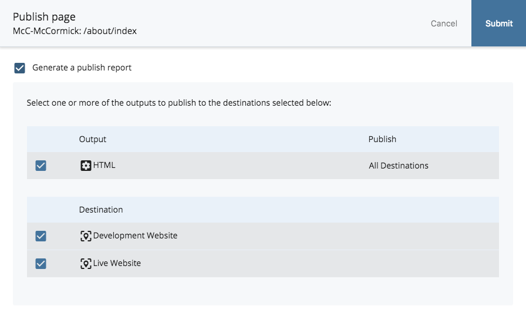

## Publishing or Un-publishing Your Assets {#publishing-or-un-publishing-your-assets}

Clicking “Submit” or “Check Content & Submit” at the top right of the page you’re editing saves your changes in Cascade. However, it will not yet appear on the web.

**After submitting your changes, your page still needs to be uploaded to the web server. That process is called Publishing.**

The publishing process is simple:

1. After submitting, click the “Publish” tab at the top of the page preview window. You can also hover over the page in the left navigation panel and click the white down arrow that appears next to the Asset Name and select “Publish.”
2. You’ll see two areas of the screen, where you’ll configure the publishing process for your pages:

* **Output:** This area displays in what kind of outputs you’ll be publishing your edits to the servers.
* **Destination:** This area shows to which servers you’ll be publishing your edits. Here you should see two options with check boxes. Those options are the two servers you can publish to:
  * “**Development Server**” is your site’s development server, on which you can test your website. You can view pages published to this environment at [http://mccormick-dev.tech.northwestern.edu](http://mccormick-dev.tech.northwestern.edu).
  * “**Live Server**” is the live server. **This option makes your content fully live and viewable by the public.**

Both will be checked by default. If you want your changes to go live immediately, select “Submit.” If you want your changes to show up on the development server only \(for example, you might want to show someone a set of proposed changes to your website\), uncheck “Live Server,” leaving only the “Development Server” checked.

**Options:** “Generate a publish report message,” if checked, means that you’ll receive a message within Cascade’s internal messaging system \(viewable from your Dashboard or from the “Messages” link in the Quick Links menu\) confirming that your page was published, and what errors, if any, occurred during publication. This is good to have, but not necessary.

Important:

When creating a new page, changing a page’s display name or removing a page, **you must publish the parent folder that contains that page/folder** to update the left-hand navigation throughout that area of your site.

“**Publish**” and “**Un-publish**” mean exactly what they seem to:

* “Publish” updates the page you’ve altered on the server
* “Un-publish” removes the page from the server entirely.

* Once you’ve selected the configuration you want, click “**Submit**” to publish your page. You’ll get a confirmation message in a green bar at the top of the page.

**Publishing is generally immediate and can be done as often as needed.**

To view your latest published changes in a browser, you may need to refresh the page or clear your browser’s cache so it pulls the most recent information from the server.

The un-publishing process is simple:

1. Go to **MoreUn-publish** and make sure you have the correct destination selected for un-publish task.
2. Locate and click the **Submit** button to un-publish. This will remove the asset from the live server but it will stay in Cascade.
3. To ensure that the un-published asset doesn’t show in the navigation of your site and stay out of publish queue, re-select the asset and go to **Edit** tab. Change the **Display in Navigation** setting to **No**. Then, go to **Configure** \(Properties for a folder\) and uncheck **include when publishing** checkbox. Locate and click **Submit** to save your changes to Cascade.
4. You may need to republish the parent folder of this asset or the whole site if the asset you just un-published appears in the navigation of your site.

**Warning:** When you un-publish, a visitor attempting to view that item will receive a _**Page**_** **_**Not Found**_ message. If this is problematic for your organization, you should upload or create an asset using the old asset’s name.

