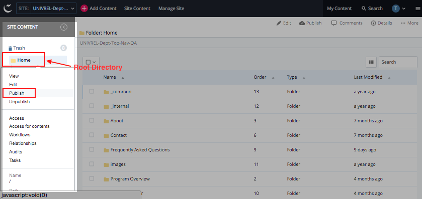
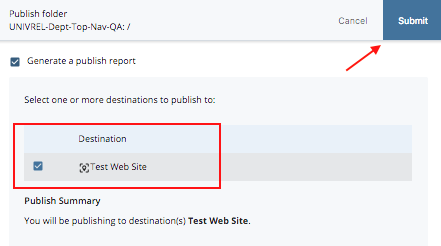

## Publishing the Entire Website {#publishing-the-entire-website}

When you update a common element, such as your top navigation or the footer, you must publish the entire website. To publish the entire site:

1.  Locate and click the root directory in the navigation panel or folder tree. It could be name **Home** or the name of your site.

1.  Right click to see the in-context menu. This shows you some of the editing tasks for a folder.
2.  Click **Publish** option. A page with live/test destinations will appear. Select the appropriate destination(s) and leave all other items checked to ensure everything publishes to your live site correctly.
3.  Locate and click the **Submit** button.

**NOTE:** If you would like to see where your asset is in the university-wide publish queue, jump to **View Publish Queue** section of this document for further instructions.