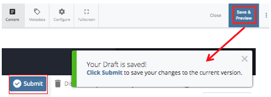

## Save &amp; Preview Vs. Submit {#save-preview-vs-submit}

In Cascade 8, **Save &amp; Preview** is the default option to save a draft and preview your edits. **Save &amp; Preview does not submit your work!** After clicking Save &amp; Preview the asset will reload with your edits, and a message will appear in the top right corner of the editing pane. This temporary message confirms that a draft has been saved and prompts you to **Submit** your work before fading away. You can select the “Click Submit” link text in the message before it disappears or the blue Submit button at any point.

If you’d like to skip the Save &amp; Preview option and submit your draft, you can click the three-dotted button at the top right corner of the editing window. A window will appear to “**Submit**” or “**Check Content &amp; Submit”.** Clicking either button **saves your changes in Cascade**. If you click “Check Content &amp; Submit”, Cascade performs guided content checks before submitting.

**NOTE:** By clicking the **Submit** button, you save your work in Cascade. You still need to publish it to the live site.