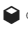
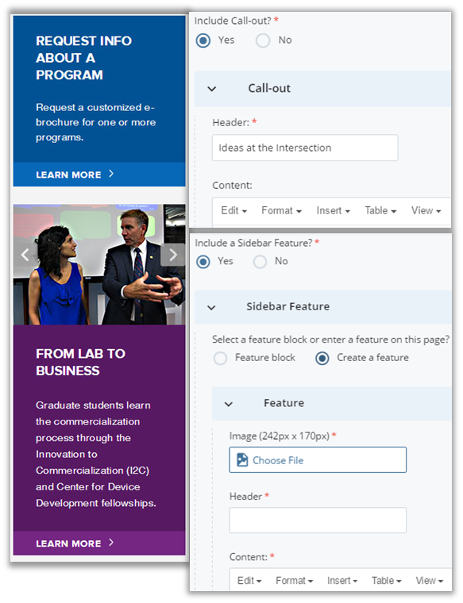

## Sidebar Options {#sidebar-options}

All pages have a right sidebar at desktop size. You can include the following 4 widgets:

*   Related Links (optional)
    *   Select “Yes” for “Include related info?” then click &quot;**∨** Related Links&quot;. Enter content for links. Click the green plus icons  to add another group/individual links.
*   Contact Info (required)
    *   Enter contact information. Click the green plus icons  to add another group/individual contacts.

*   Call-out (optional)
    *   Fill out the Header and Content regions
*   Sidebar Feature (optional) To add, select &quot;Yes&quot; for &quot;Include a Sidebar Feature?&quot; Then, click the &quot;**∨** Sidebar Feature&quot; box. You can create a feature for the specific page you’re editing or use a feature block, which can be added to multiple pages.
    *   Create a feature: Select an image with dimensions 242 by 170px and fill out the Header and Content regions. Select the &quot;Link Type&quot; if you want the feature to link to another page. To add slides, click the green plus sign at the top right. 
    *   Feature block: Select this option if you would like to insert a general sidebar feature bloc for more than one page. Sidebar feature blocks are stored in the “sidebar-features” folder and each will have a block icon 

To create a new general sidebar feature:

1.  Go to “Add ContentSidebar Feature” and give your general feature a descriptive Asset Name.
2.  Fill in the appropriate fields for your slide(s) and submit.
3.  Publish **any image assets** added to the block separately. Unfortunately, the images won’t appear in the sidebar slideshows if you have not published them separate from the page(s) you add the block to.
4.  The feature-block will be stored in the “sidebar-features” folder and you can choose to add it to any page by selecting the Feature block sidebar option.

