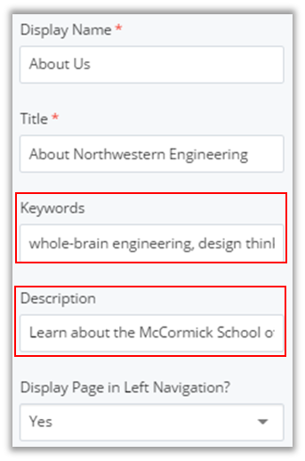
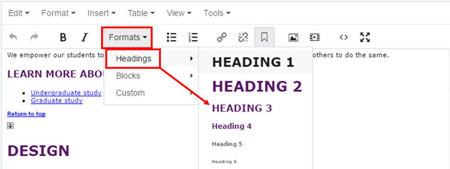
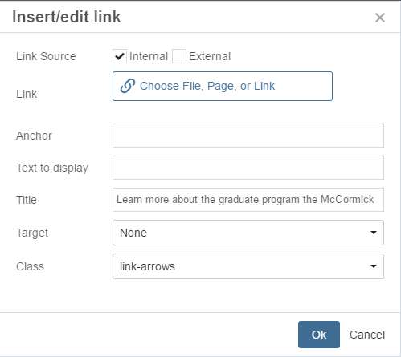

## Writing for the Web {#writing-for-the-web}

When creating web content, remember two important ideas:

* **Make your webpages easy to scan.** Visitors are generally looking to find the information they need quickly and move on.
* **Make your webpages easy for search engines to find.** This is called **Search Engine Optimization \(SEO\)**.

Having excellent content isn’t of much use if users can't locate it by searching. While there are no guarantees when it comes to SEO, implementing the following best practices may result in better search results.

In addition to improving SEO, the practices mentioned below will improve the experience of visitors to your website and are an important part of complying with accessibility standards for the web.

### Optimize Asset Names {#optimize-asset-names}

In Cascade, the names of the actual files and folders are called Asset Names. Asset Names also become part of the webpage's URL that is visible in the address bar of web browsers. It's important that they're consistent and optimized for search engines.

Asset Names should always be:

* made up of **keywords** relating to the content
* formatted as **lowercase**
* separated by **hyphens**.

**Do not use spaces or capital letters.**

For example, "research-laboratory-staff" and "guidelines-for-faculty-publications.pdf" follow best practices for Asset Names.

It's also best to **avoid using dates** in Asset Names. This prevents you from having to create a new file or change the Asset Name if you need to update that information. For example, "student-handbook.pdf" is better and easier to maintain than "student-handbook-feb-2013.pdf." This also saves you the trouble of having to recreate the links to that document on your webpages.

### Use Descriptive Page Titles {#use-descriptive-page-titles}

The page title is the phrase that appears in the top of the web browser bar while a user views a page. Search engines weigh page titles heavily when determining search results. This information also appears as the page title at the top of your webpage’s content area.

In Cascade, you can edit the title of your page under in the Edit tab, in the “Inline Metadata” section where it says “Title.”

### Include Metadata {#include-metadata}

In Cascade’s page editor, below the Display Name and Title fields, you will see fields for Keywords and Description.

In the **Description** field, type a descriptive, concise sentence explaining the contents of the page you’re working on. This description will appear on Google’s search results pages.

Include relevant search terms in the **Keywords** field. This will also help search engines like Google find your webpages.

### Optimize Your Copy {#optimize-your-copy}

* Make your page copy simple and concise.
* Break it into more numerous small paragraphs.
* Use bullet points whenever possible.

### Use Headers and Subheaders {#use-headers-and-subheaders}

Google's search engine \(and Northwestern’s internal search appliance\) gives more weight to pages containing search terms in header tags.

In addition, usability studies have repeatedly shown that users scan web pages, rather than setting out to read them from top to bottom. This means that concise copy and frequent \(but judicious\) use of subheadings is vital to making your pages useful to your readers.

Using headings and subheadings frequently is also important to building ADA-compliant pages: Screen readers used by people with visual impairments detect the HTML code that indicates headers \(&lt;h1&gt;, &lt;h2&gt;, &lt;h3&gt;\) and pay more attention to them than they do to ordinary paragraph copy — even if paragraph copy is set in bold or italic.

To create a heading or subheading in the Cascade content management system, select the text you wish to use as a header, then, in the Cascade Editor window, click the “Format” drop-down menu:

* For headers in the content areas of your webpages, use **“Heading 2”**
* For subheaders, use **“Heading 3.”**

The importance of a heading descends as its number ascends — information used as a Heading 2 should be more important than that of a Heading 3.

With this website template, you should not use any “Heading 1” formatting, since Cascade automatically formats your site title to that heading.

### Link Frequently and Use Keywords {#link-frequently-and-use-keywords}

If you mention a page or document in your text, link to that page or document, particularly if it’s necessary to complete the task your visitor is trying to accomplish.

When choosing what words to activate as your link, it’s best to link to the key words in that sentence, not the entire sentence. Also, avoid writing “click here” as your link.

Take the example of this sentence with a “click here” link: _“Professor Smith has worked extensively with the Smith Catalysis Laboratory \(click here for more info\).”_

It’s better to create the link like this: _“Professor Smith has worked extensively with the Smith Catalysis Laboratory.”_

For detailed instructions on adding links in Cascade, see the “[Inserting and Editing Links](inserting_and_editing_links.md)” section of this guide.

**It is also important to fill in the “Title” of your link.**

The text you enter into the “Title” field shows up as the “tool tip” text that appears over a link when a user hovers their mouse over it on a finished page.

Not only can this information be extremely helpful when navigating our website, it’s also a requirement to keep a web page compliant with ADA standards.

### Use Alt Tags on All Images {#use-alt-tags-on-all-images}

Cascade requires you to fill in the “Alternate Text” field \(producing what’s known as an “Alt” tag\) when including any photograph. The Alt tag text becomes the image caption on the page. Therefore, it’s important to use complete sentences to describe what’s shown in a photo. Alt tags are a requirement for ADA compliance.

