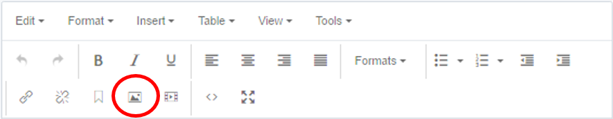
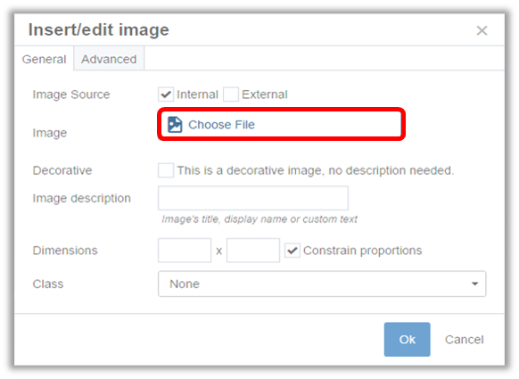
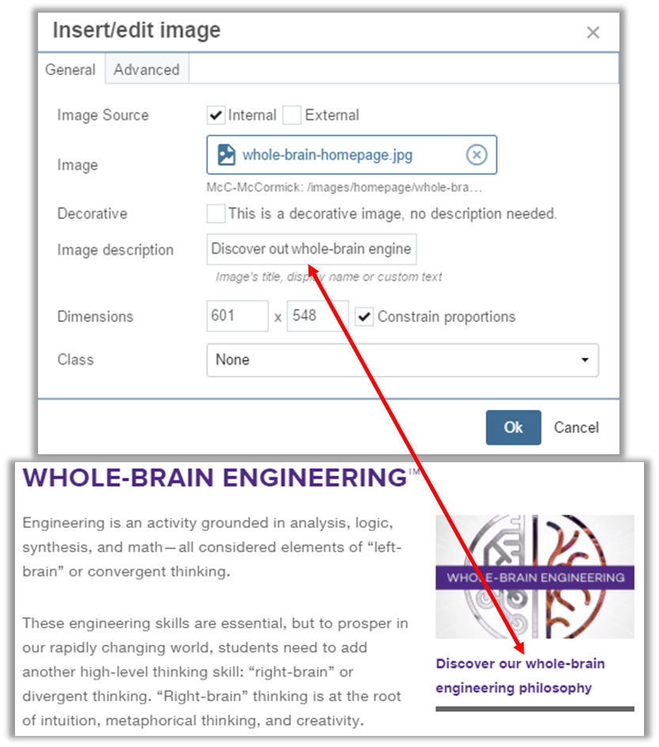

## Inserting an Image on Page {#inserting-an-image-on-page}

1.  Place your mouse cursor in the area of the copy where you want to place an image, and click on the “Insert / Edit Image” icon (the mountain and the moon picture) in the toolbar.
2.  Choose whether you want to create an internal or an external image. An internal image (default option) is a file that is already in the system, or one that you upload. (An external image is one that you link to using a URL. This option is rarely used and is for images hosted by external sites.)
3.  Next to Image, you will see the “Choose File” icon. Click on the icon.

In the new image chooser window, you can either navigate to an existing image using the default Browse option, search for an image, or click on the Upload option to upload a file. If you choose to upload a new image into Cascade, **always upload new images to the images folder.** If you are going to be working with a lot of images, you may want to create sub-folders under the “images” folder to keep them organized.

1.  Once you have the image selected, click Choose to close the image chooser window. The image path will appear in the “Insert/Edit Image” window.
2.  In the Image Description field, type in a text description of what the image depicts in a complete sentence. This required text becomes the image’s caption on the page and ensures that if the image doesn’t load properly, or if a screen reader is being used, the user can still understand what the content is.

1.  While you can specify the width/height of the image here, it is highly recommended that you size photos outside of Cascade, as explained in the section of this guide called “[Preparing Images](preparing_images.md)”.
2.  Click “Ok” for the image to be placed within the copy you selected.