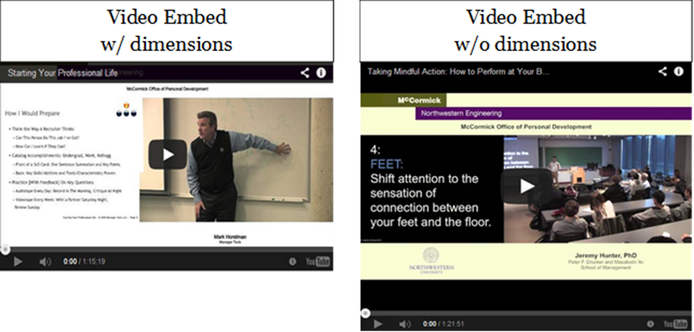

## Inserting Video on Page {#inserting-video-on-page}

You have the ability to embed a video from YouTube so that it plays on one of your site’s webpages.

To embed a video so it displays on one of your pages:

1.  Go to that video’s page on YouTube.
2.  Copy the video URL from the address bar

In Cascade, select the Video Reel icon  and paste the YouTube video url in the File/URL field. Uncheck &quot;Constrain Proportions&quot; in the next line and enter the proper video dimensions: **670 x 377** for the basic page.

Click OK. A preview box will appear in your editing window indicating its placement on the page. You can preview the video on the editing window.

**Note:** If you do not enter the dimensions, the video will display with large black bars above and below it.

Publish this page to see how it appears on the web by following the instructions in the section of this guide called “[Publishing Your Webpages](../module_2_editing_a_basic_page/submit_vs_publish.md#115333639914907-_Publishing_Your_Webpages)”

Important: **Do not use the embed code** method of inserting videos on your page. You will receive and error message while previewing in Cascade and on the live site if published.