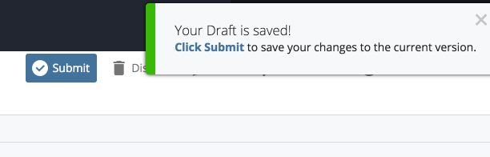

## Uploading Image/Doc {#uploading-image-doc}

1. After navigating to the content page of the website you are editing, select “Add Content” &gt; “Image – JPG GIF PNG SVG” for images and “Add Content” &gt; “Document – PDF TXT DOC PPT POT XLS” for documents.
2. You can either drag and drop the file\(s\) to the noted area or choose one or more from your computer. You can upload more than one image or document at a time without zipping the files first. When uploaded, you’ll see a preview and the dimensions of the file\(s\). Do not alter the image size in Cascade. All image resizing should be done in Photoshop or another photo editing software before uploading the image to Cascade.
3. Once you’ve found and attached the file, the name of the file will be populated in the “File Name” field above.

   1. You can then edit the name of the file in the field. Be sure the **File Name** of your new file follows the guidelines mentioned  above \(e.g., use keywords, all lowercase, no spaces, words separated by hyphens\). Also specify the proper file extension \(e.g., .pdf, .doc, .xls, .txt\)

   2. **Placement Folder:** Click this link to specify in which “images” or “documents” subfolder the file will be stored. By default, any image file will be stored in the “images” folder and any document will be stored in “documents”

#### Important:

**Do not move your images or documents into any other folder besides images/documents and their subfolders.**

* Documents and non-image files go in your “documents” folder.
* Images go in your “images” folder.

* Click **Save & Preview**. The next screen shows you a preview of the file. This is just a draft of the file you just uploaded. If the file looks okay, locate and click the blue **Submit** button on the editing screen.

