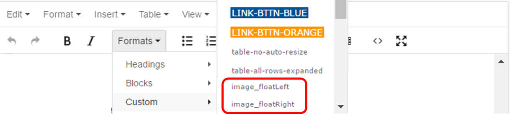
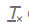
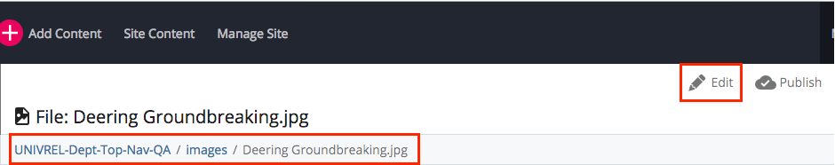
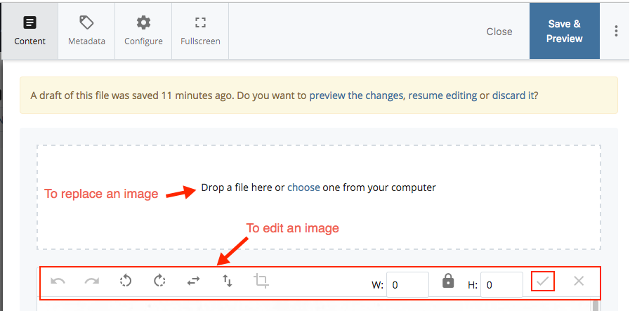

## Working with Images {#working-with-images}

Using the tools below you can shift the layout of your inserted images or edit and replace the images on your webpages.

### Assigning an Image Class {#assigning-an-image-class}

If you’re planning on aligning an image to the right or left **you must use the “Formats &gt; Custom” menu** to assign it a “class.”

### Aligning an Image to the Right or Left {#aligning-an-image-to-the-right-or-left}

1.  Select the image in the Edit window.
2.  Click the “Formats” menu and then “Custom” menu. Select image_floatRight or image_floatLeft.

This will align your image to the right or left, and add padding around it, which keeps page text from getting too close.

**IMPORTANT:** Image styles are “additive,” meaning the code created when you choose a style or alignment is not removed if you choose another style for the image. **To change an image style or alignment, you must first select the image and click the “Format &gt; Clear Formatting”  tool from the tool bar menu.** That step removes the previous alignment. Then you can select a new style or alignment from the “Formats &gt; Custom” drop down menu

### Editing and Replacing Images {#editing-and-replacing-images}

You may want to alter an image once you’ve added it to a page:

*   Locate and click the appropriate folder. Typically, images are saved under images folder.
*   Click the image you wish to edit or replace. This will display a preview of the image or file (some files will not display) in the main Cascade window.
*   Toward the top of the main window, locate and click **Edit**. The edit screen will load in the main window.

*   On edit screen, you will see the option to replace the image and a toolbar that allows you to edit it. Make appropriate changes and click on **Save &amp; Preview** button.
*   You will be redirected to the image preview screen and get a confirmation popup at the top of the screen stating a draft was saved. If everything looks, click Submit to save your changes permanently in Cascade.
*   Go to Publish tab and publish your changes to the live site.

*   Next, go to **More Relationships** tab and publish all relationships if the file has any. You will need to select the checkboxes to select the assets that you want to publish.

**NOTE**: You need to publish relationships only when you move, rename or delete a document or a webpage, or when you replace an existing document with a new one. You don’t need to publish relationships when you’re making any changes in the content itself.

If you have an alternate version of an image that you would like to upload in the place of the current image:

*   Navigate to the existing image file in the “images” folder.
*   Once the file is selected, click “Edit,” then use the “Upload” option to upload your new image. Cascade will point to the new image instead of the previous one.

Replacing your images assets this way instead of creating whole new files prevents clutter in your images folder.