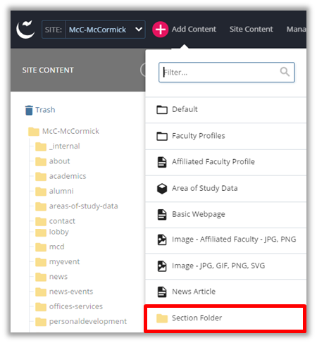
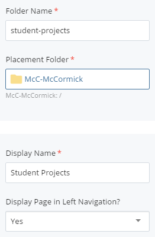

## Creating Section Folders {#creating-section-folders}

The first step in creating your site’s structure is to create the folders that organize your content.

When creating a new section of your site, you will use the Section Folder asset, which creates both a folder with an “index” page inside. Both the folder and index page must be edited. You’ll learn more about index pages in the next section.

It is highly recommended that you **create a Section Folder in Cascade for each top-level link or section** you would like to appear in your left-hand navigation, even if you only plan to have one webpage in that section. There are two reasons for using folders this way:

*   Should you decide to add more webpages or content to a section of your site in the future, you will already have the folder in place that is properly named and ready to contain those additional pages.
*   Should you decide to expand an area of your website from a single page to a section containing multiple pages, without a proper folder structure, you would need to change the Asset Name and location of that one page and possibly others. Since the Asset Name becomes part of a page’s URL, this could lead to multiple broken links for visitors who return to your site after the adjustment. It’s best to start off with a folder structure that allows your website to grow.

Since Cascade generates your site’s navigation from folders and their names, it’s important to name them properly. This begins when you create a folder.

1.  For this example, we’ll create a “student-projects” folder which will contain pages telling visitors about McCormick student projects.
2.  In the Menu bar, click “Add Content,” and then click “Section Folder.”

1.  Replace the default “section” name in “Folder Name” (Asset Name) field with your new name. In this case, call it “student-projects.”**NOTE:** The names of **all assets in Cascade**, including folders, should be **lower-case** and should **substitute hyphens** for spaces. **No Cascade Asset should contain spaces in its Asset Name.** In addition, it’s important to use **keywords** in your Asset Names. The Asset Name becomes part of the URL path.

1.  Make sure that the “Placement Folder” shown is the one where you want the new asset to “live.” You can change the Placement Folder by clicking the input section. This will open a new window that will let you choose the correct Placement Folder. In our example, since we want the “students” folder to appear as a top-level link in the site’s navigation, put it directly in the Site Name folder (Here, McC-McCormick) which is indicated by [/]. If it is not chosen by default, select the folder and click “Choose.”
2.  The section below contains the Display Name for your new section folder and the option to display it in the left navigation. New folders you create will be displayed in the navigation by default unless you select “No” in the dropdown.

A Cascade asset’s **Display Name** is the name that appears in the left navigation panel and the page’s breadcrumb navigation.

Enter a Display Name. Display Names should substitute “&amp;” for the word “and” since space is limited in the left sidebar. In our example, you can name it “Student Projects.”

1.  In the area marked at the top with “Properties,” there are two checkboxes that should be checked by default:

**“Include when indexing”** means that the pages within this folder will be included (and show up in) the left-hand navigation of your site.

**“Include when publishing”** means that this folder and its contents can be published with the rest of your site, so they will appear on the live website.

1.  Click “Submit.”