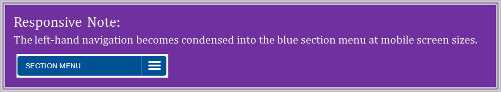
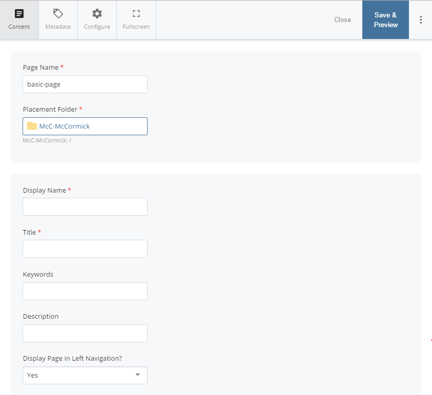

## Creating Webpages (Second-Level Navigation) {#creating-webpages-second-level-navigation}

Pages that are not the “index” page in a folder will appear to a visitor as a second-level of links in your website’s left-hand navigation.

1.  (Optional): Navigate to the folder where you want to create a new webpage. (If you don’t do this now, you can choose the destination folder in a moment.)
2.  In the top Menu Bar, click “Add Content,” then choose “Basic Webpage.” The “New Page” window will appear in your Main Panel.

1.  Give your new webpage a **Page Name**.

**Since your Page Name becomes part of that page’s URL, it is best to give your page a Page Name that uses lowercase keywords separated by hyphens. Do not use any spaces.**

1.  If you didn’t already do so in Step 1, select the “Placement Folder” link and navigate to the site folder where you want to put your new page.
2.  Enter your new page’s Display Name and Title in the appropriate fields, and (if you have it ready) place your new page’s content in the main content field.
3.  Click “Submit.”

**NOTE:** You will need to manually publish your changes; see “[Publishing Your Webpages](../module_2_editing_a_basic_page/submit_vs_publish.md#115333639914907-_Publishing_Your_Webpages)” for more information on publishing pages.