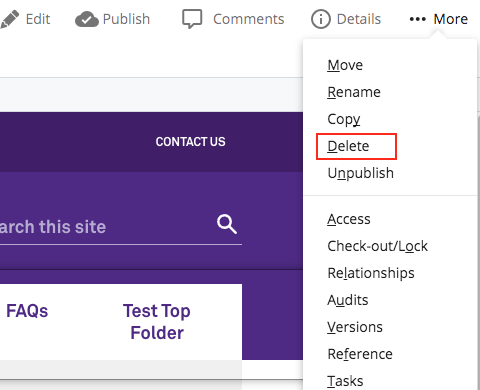
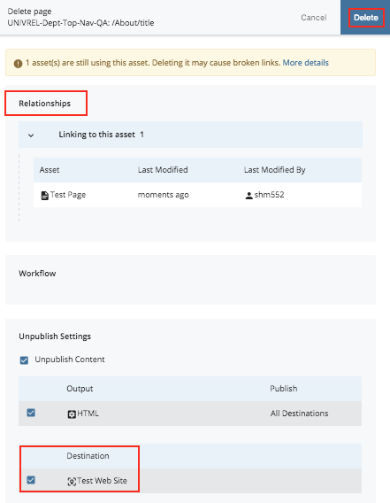

## Deleting Folders/Files {#deleting-folders-files}

*   Click on the asset
*   Click the **More** option and the **Delete** option in the dropdown menu.

*   Check **Un-publish Content** while deleting to remove the page from the live site as well as Cascade. **IMPORTANT**: If you do not check this box the page will remain on the site with no way to edit it in the future.
*   Cascade also displays alerts for what pages/assets are linking to the file and will need to be updated before deleting.

*   Deleted files stay in **Recycle Bin** for **15 Days**

You can also hover over assets in the left navigation panel and click the white down arrow that appears and select “Delete” from the contextual menu.