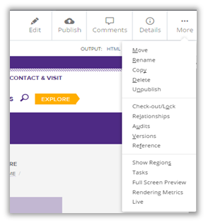

## Versions {#versions}

*   Cascade retains **the 90 most recent versions** of an asset
*   To view previous versions, select an asset in the left navigation panel, click the **More** tab and click **Versions**

*   You should be presented with a table of all previous versions.
    *   When they were last modified and who modified them.
*   Locate and click the version you would like to view. A preview of the previous version is displayed in the main Cascade window.

*   If you want to view other versions, you can click on **More** to see other viewing options. You can view an older version, view a newer version, view current version, delete the version or restore it. Notice that the **More** dropdown doesn’t list any of the in-context editing options like move/delete/publish.

*   If you wish to roll back to the version you are viewing, click on **Restore this version**. Cascade will create a copy of the old version and this will become your newest version. You may edit this version or just publish to the live site.