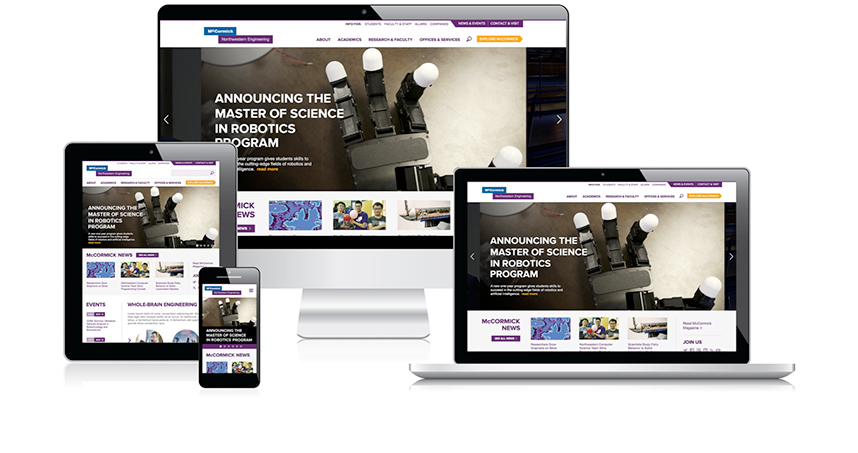

```

```

# What’s Responsive? {#what-s-responsive}



Today, you can access websites on a desktop, laptop, tablet, mobile phone and other devices, each with varying screen sizes. Responsive design is a method of creating a flexible or fluid website layout that will adapt to any size screen.

The layout of the page changes and items in the page shrink, shift around and collapse as the viewing screen size decreases. Because the layout transforms for different screen sizes, it’s important not to refer to things on the page as “to the left,” “above,” “below,” or “to the right.” The position may change. It’s also very important to follow guidelines illustrated in this manual for headers, image sizes, etc. to ensure the site looks good and performs well on different devices.

Take a look at how the basic page transforms as the screen decreases from desktop size down to mobile:

```

```


